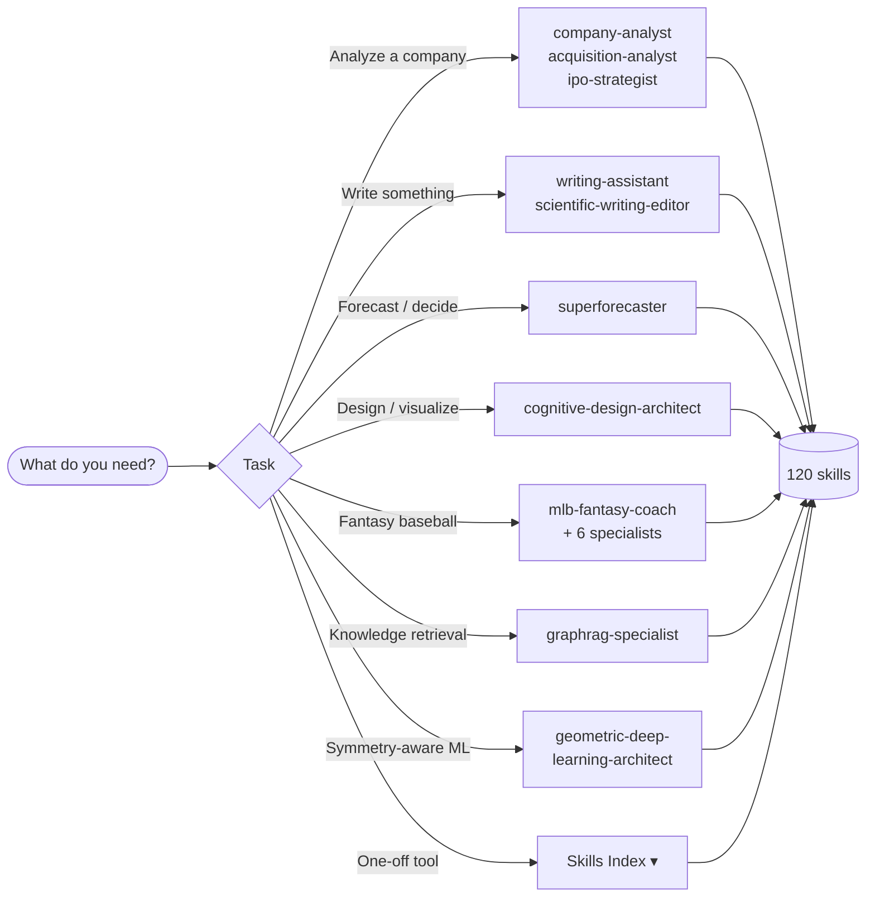

# Claude Code Skills Collection

   [](https://smithery.ai/skills?ns=lyndonkl&utm_source=github&utm_medium=badge)

A production-ready library of **120 skills** and **18 orchestrating agents** for Claude Code — covering thinking frameworks, research, writing, design, data/ML, corporate finance, game theory, and fantasy baseball.

**Install in 30 seconds:**

```
/plugin marketplace add lyndonkl/claude
/plugin install thinking-frameworks-skills
```

---

## I want to…

Pick the fastest entry point for what you're trying to do. Most users start with an **agent** (which orchestrates many skills); power users invoke **skills** directly.

| I want to… | Start here |
|---|---|
| Value a company / analyze an M&A target / plan an IPO | [`company-analyst`](agents/company-analyst.md), [`acquisition-analyst`](agents/acquisition-analyst.md), [`ipo-strategist`](agents/ipo-strategist.md), [`special-situations-analyst`](agents/special-situations-analyst.md) |
| Decide how to allocate capital (debt / dividends / projects) | [`capital-allocation-strategist`](agents/capital-allocation-strategist.md) |
| Manage my Yahoo Fantasy Baseball team | [`mlb-fantasy-coach`](agents/mlb-fantasy-coach.md) + 6 MLB specialists |
| Write a paper / grant / recommendation letter | [`scientific-writing-editor`](agents/scientific-writing-editor.md) |
| Improve any piece of writing (blog, memo, essay) | [`writing-assistant`](agents/writing-assistant.md) |
| Make a calibrated forecast or probability estimate | [`superforecaster`](agents/superforecaster.md) |
| Design a dashboard, viz, or UI grounded in cognition | [`cognitive-design-architect`](agents/cognitive-design-architect.md) |
| Build a GraphRAG / knowledge-graph retrieval system | [`graphrag-specialist`](agents/graphrag-specialist.md) |
| Design equivariant / symmetry-aware neural networks | [`geometric-deep-learning-architect`](agents/geometric-deep-learning-architect.md) |
| Use just one tool (no agent) | Browse the [Skills Index](#skills-index) below |

## How the pieces fit together



---

## Orchestrating Agents

Agents detect your need and route to the right skills. Each agent's page documents the skills it orchestrates and the workflow it runs.

| Agent | Domain |
|---|---|
| [**writing-assistant**](agents/writing-assistant.md) | Any writing task — structure, revision, stickiness, pre-publish gate |
| [**scientific-writing-editor**](agents/scientific-writing-editor.md) | Manuscripts, grants, letters, reviewer responses, career docs |
| [**superforecaster**](agents/superforecaster.md) | Forecasting and probability via 5-phase calibrated pipeline |
| [**cognitive-design-architect**](agents/cognitive-design-architect.md) | Cognitive design, information architecture, D3 viz, fallacy check |
| [**geometric-deep-learning-architect**](agents/geometric-deep-learning-architect.md) | Symmetry discovery → group ID → equivariant architecture |
| [**graphrag-specialist**](agents/graphrag-specialist.md) | Knowledge graph construction, embedding fusion, retrieval orchestration |
| [**company-analyst**](agents/company-analyst.md) | End-to-end company valuation → buy/sell/hold recommendation |
| [**special-situations-analyst**](agents/special-situations-analyst.md) | Distressed / private / high-growth / financial-firm valuation |
| [**capital-allocation-strategist**](agents/capital-allocation-strategist.md) | Financing mix, dividends/buybacks, project investment |
| [**acquisition-analyst**](agents/acquisition-analyst.md) | M&A standalone + synergy + max bid |
| [**ipo-strategist**](agents/ipo-strategist.md) | Pre-IPO → post-IPO valuation and pricing range |
| [**mlb-fantasy-coach**](agents/mlb-fantasy-coach.md) | Primary Yahoo Fantasy Baseball orchestrator; morning briefs |
| [**mlb-lineup-optimizer**](agents/mlb-lineup-optimizer.md) | Daily start/sit with advocate + critic variants |
| [**mlb-waiver-analyst**](agents/mlb-waiver-analyst.md) | Weekly add/drop and FAAB bid sizing |
| [**mlb-streaming-strategist**](agents/mlb-streaming-strategist.md) | Weekly pitching plan, two-start SPs, spot starts |
| [**mlb-trade-analyzer**](agents/mlb-trade-analyzer.md) | On-demand trade offer evaluation with always-counter ladder |
| [**mlb-category-strategist**](agents/mlb-category-strategist.md) | Weekly push/punt plan across the 10 H2H categories |
| [**mlb-playoff-planner**](agents/mlb-playoff-planner.md) | July-onward positioning for weeks 21–23 playoff window |

---

## Skills Index

**120 skills** across 6 super-categories. Every skill's full methodology, templates, and evaluation rubric live in its `SKILL.md` — click any entry to drill in.

<details>
<summary><b>🧠 Thinking & Decisions</b> — decision-making, problem-solving, estimation, dialogue, ideation, learning (37 skills)</summary>

### Strategy & decision-making

- **[decision-matrix](skills/decision-matrix/SKILL.md)** — Compare options against weighted criteria to pick defensibly.
- **[expected-value](skills/expected-value/SKILL.md)** — Weight outcomes by probability to choose under uncertainty.
- **[bayesian-reasoning-calibration](skills/bayesian-reasoning-calibration/SKILL.md)** — Update probabilities with evidence and calibrate confidence.
- **[heuristics-and-checklists](skills/heuristics-and-checklists/SKILL.md)** — Prevent recurring errors with fast rules and 5–9 item checklists.
- **[hypotheticals-counterfactuals](skills/hypotheticals-counterfactuals/SKILL.md)** — Stress-test decisions with "what if" scenarios and premortems.
- **[kill-criteria-exit-ramps](skills/kill-criteria-exit-ramps/SKILL.md)** — Define when to stop a project before sunk cost traps you.
- **[alignment-values-north-star](skills/alignment-values-north-star/SKILL.md)** — Connect daily choices to a shared North Star and values.
- **[environmental-scanning-foresight](skills/environmental-scanning-foresight/SKILL.md)** — Spot weak signals and plan scenarios via PESTLE.
- **[portfolio-roadmapping-bets](skills/portfolio-roadmapping-bets/SKILL.md)** — Size and sequence H1/H2/H3 bets with 70-20-10 balance.
- **[prioritization-effort-impact](skills/prioritization-effort-impact/SKILL.md)** — Sort a backlog into Quick Wins, Big Bets, Time Sinks.
- **[project-risk-register](skills/project-risk-register/SKILL.md)** — Identify, score, and monitor project risks by probability × impact.
- **[prototyping-pretotyping](skills/prototyping-pretotyping/SKILL.md)** — Validate demand cheaply before building via fake doors and MVPs.
- **[postmortem](skills/postmortem/SKILL.md)** — Turn failures into learning with blameless timelines and SMART actions.
- **[strategy-and-competitive-analysis](skills/strategy-and-competitive-analysis/SKILL.md)** — Build strategy using Rumelt's kernel, Porter, Blue Ocean, Playing to Win.

### Problem-solving & analysis

- **[decomposition-reconstruction](skills/decomposition-reconstruction/SKILL.md)** — Break complex systems into parts, then recompose with insight.
- **[causal-inference-root-cause](skills/causal-inference-root-cause/SKILL.md)** — Distinguish causation from correlation; find true root causes.
- **[abstraction-concrete-examples](skills/abstraction-concrete-examples/SKILL.md)** — Move between abstract principle and concrete example to clarify.
- **[layered-reasoning](skills/layered-reasoning/SKILL.md)** — Reason consistently across strategic / tactical / operational layers.
- **[negative-contrastive-framing](skills/negative-contrastive-framing/SKILL.md)** — Define fuzzy criteria by showing what they are NOT.
- **[synthesis-and-analogy](skills/synthesis-and-analogy/SKILL.md)** — Integrate sources and transfer insights across domains.
- **[systems-thinking-leverage](skills/systems-thinking-leverage/SKILL.md)** — Find leverage points in feedback loops and system archetypes.

### Estimation & forecasting

- **[estimation-fermi](skills/estimation-fermi/SKILL.md)** — Produce order-of-magnitude estimates via decomposition and bounding.
- **[reference-class-forecasting](skills/reference-class-forecasting/SKILL.md)** — Anchor predictions in base rates from similar past events.
- **[forecast-premortem](skills/forecast-premortem/SKILL.md)** — Stress-test a forecast by assuming it failed; surface tail risks.
- **[scout-mindset-bias-check](skills/scout-mindset-bias-check/SKILL.md)** — Detect and remove bias with reversal tests and confidence audits.
- **[chain-estimation-decision-storytelling](skills/chain-estimation-decision-storytelling/SKILL.md)** — Chain Fermi estimation → EV → narrative into a recommendation.

### Dialogue & deliberation

- **[deliberation-debate-red-teaming](skills/deliberation-debate-red-teaming/SKILL.md)** — Stress-test plans via Oxford debate, fishbowl, devil's advocate.
- **[dialectical-mapping-steelmanning](skills/dialectical-mapping-steelmanning/SKILL.md)** — Steelman both sides and synthesize a principled third way.
- **[chain-roleplay-debate-synthesis](skills/chain-roleplay-debate-synthesis/SKILL.md)** — Multi-expert roleplay and debate for complex decisions.
- **[role-switch](skills/role-switch/SKILL.md)** — Analyze decisions from each stakeholder's perspective to find alignment.

### Ideation & creativity

- **[brainstorm-diverge-converge](skills/brainstorm-diverge-converge/SKILL.md)** — Generate many ideas, cluster, then narrow via dot voting.
- **[constraint-based-creativity](skills/constraint-based-creativity/SKILL.md)** — Turn limitations into creative fuel via strategic constraints.
- **[morphological-analysis-triz](skills/morphological-analysis-triz/SKILL.md)** — Systematically explore design space and resolve contradictions.

### Productivity & learning

- **[focus-timeboxing-8020](skills/focus-timeboxing-8020/SKILL.md)** — Protect attention with Pareto, Pomodoro, and deep-work blocks.
- **[memory-retrieval-learning](skills/memory-retrieval-learning/SKILL.md)** — Build durable retention via spaced repetition and retrieval practice.
- **[socratic-teaching-scaffolds](skills/socratic-teaching-scaffolds/SKILL.md)** — Teach via strategic questions and fading scaffolds.
- **[meta-prompt-engineering](skills/meta-prompt-engineering/SKILL.md)** — Turn vague prompts into reliable, structured, verifiable ones.

</details>

<details>
<summary><b>🔬 Research & Evidence</b> — research design, evidence evaluation, rubrics, ethics (6 skills)</summary>

- **[discovery-interviews-surveys](skills/discovery-interviews-surveys/SKILL.md)** — Run unbiased JTBD interviews and surveys with thematic coding.
- **[design-of-experiments](skills/design-of-experiments/SKILL.md)** — Design rigorous factorial, RSM, and Taguchi experiments.
- **[domain-research-health-science](skills/domain-research-health-science/SKILL.md)** — Formulate PICOT questions and GRADE clinical evidence.
- **[research-claim-map](skills/research-claim-map/SKILL.md)** — Verify claims via triangulation, source grading, confidence calibration.
- **[ethics-safety-impact](skills/ethics-safety-impact/SKILL.md)** — Assess harms, fairness, and mitigations across stakeholders.
- **[evaluation-rubrics](skills/evaluation-rubrics/SKILL.md)** — Design rubrics with calibrated scales and inter-rater reliability.

</details>

<details>
<summary><b>✍️ Communication & Writing</b> — writing pipeline, scientific writing, audience adaptation (13 skills)</summary>

### General writing

- **[writing-structure-planner](skills/writing-structure-planner/SKILL.md)** — Plan writing architecture via McPhee's structural diagramming.
- **[writing-revision](skills/writing-revision/SKILL.md)** — Run the three-pass revision: clutter, cognitive load, rhythm.
- **[writing-stickiness](skills/writing-stickiness/SKILL.md)** — Make messages memorable using the Heath SUCCESs framework.
- **[writing-pre-publish-checklist](skills/writing-pre-publish-checklist/SKILL.md)** — Final 6-section quality gate before publishing.
- **[communication-storytelling](skills/communication-storytelling/SKILL.md)** — Craft narratives using arcs, tension, and audience framing.
- **[translation-reframing-audience-shift](skills/translation-reframing-audience-shift/SKILL.md)** — Adapt content for a new audience without losing accuracy.
- **[one-pager-prd](skills/one-pager-prd/SKILL.md)** — Write concise one-pagers and PRDs for stakeholder alignment.

### Scientific & academic writing

- **[scientific-manuscript-review](skills/scientific-manuscript-review/SKILL.md)** — Edit IMRaD research manuscripts for clarity and rigor.
- **[grant-proposal-assistant](skills/grant-proposal-assistant/SKILL.md)** — Assist NIH / NSF grant writing with Specific Aims + Strategy.
- **[academic-letter-architect](skills/academic-letter-architect/SKILL.md)** — Craft evidence-based recommendation and nomination letters.
- **[scientific-email-polishing](skills/scientific-email-polishing/SKILL.md)** — Polish editor letters, reviewer responses, collaboration emails.
- **[scientific-clarity-checker](skills/scientific-clarity-checker/SKILL.md)** — Audit scientific claims, hedging, and terminology consistency.
- **[career-document-architect](skills/career-document-architect/SKILL.md)** — Develop research, teaching, diversity statements and CVs.

</details>

<details>
<summary><b>🏗️ Building & Shipping</b> — architecture, design, security, org, product delivery (15 skills)</summary>

### Architecture & product

- **[adr-architecture](skills/adr-architecture/SKILL.md)** — Document architecture decisions with context, options, consequences.
- **[chain-spec-risk-metrics](skills/chain-spec-risk-metrics/SKILL.md)** — Chain spec → risk → success metrics for launches.
- **[roadmap-backcast](skills/roadmap-backcast/SKILL.md)** — Plan backward from deadline to identify critical path and feasibility.
- **[metrics-tree](skills/metrics-tree/SKILL.md)** — Decompose a North Star metric into sub-metrics and leading indicators.

### Design & information architecture

- **[information-architecture](skills/information-architecture/SKILL.md)** — Organize content via card sort, taxonomy, and tree testing.
- **[cognitive-design](skills/cognitive-design/SKILL.md)** — Ground design decisions in perception, memory, and Gestalt.
- **[design-evaluation-audit](skills/design-evaluation-audit/SKILL.md)** — Audit existing designs against cognitive-alignment checklists.
- **[cognitive-fallacies-guard](skills/cognitive-fallacies-guard/SKILL.md)** — Detect chartjunk, misleading axes, and bias in visualizations.
- **[visual-storytelling-design](skills/visual-storytelling-design/SKILL.md)** — Turn data into narrative via annotation and scrollytelling.
- **[d3-visualization](skills/d3-visualization/SKILL.md)** — Build custom interactive charts, networks, and maps with D3.js.

### Security

- **[security-threat-model](skills/security-threat-model/SKILL.md)** — Apply STRIDE with trust boundaries and defense-in-depth.

### Org & facilitation

- **[facilitation-patterns](skills/facilitation-patterns/SKILL.md)** — Run productive meetings, workshops, and retros.
- **[negotiation-alignment-governance](skills/negotiation-alignment-governance/SKILL.md)** — Align stakeholders via RACI, BATNA, and conflict protocols.
- **[reviews-retros-reflection](skills/reviews-retros-reflection/SKILL.md)** — Run blameless retros with SMART actions (Start/Stop/Continue, Sailboat).
- **[stakeholders-org-design](skills/stakeholders-org-design/SKILL.md)** — Map stakeholders; design teams via Conway and Team Topologies.

</details>

<details>
<summary><b>📊 Data & ML</b> — data modeling, visualization, GraphRAG, geometric deep learning (14 skills)</summary>

### Data modeling & visualization

- **[data-schema-knowledge-modeling](skills/data-schema-knowledge-modeling/SKILL.md)** — Model entities and relationships for DBs, graphs, ontologies.
- **[code-data-analysis-scaffolds](skills/code-data-analysis-scaffolds/SKILL.md)** — Generate code scaffolds for analysis across Python / R / SQL.
- **[visualization-choice-reporting](skills/visualization-choice-reporting/SKILL.md)** — Pick the right chart and narrate the insight to action.
- **[mapping-visualization-scaffolds](skills/mapping-visualization-scaffolds/SKILL.md)** — Map relationships with trees, networks, layers, swimlanes.

### Geometric deep learning

- **[symmetry-discovery-questionnaire](skills/symmetry-discovery-questionnaire/SKILL.md)** — Discover hidden data symmetries collaboratively.
- **[symmetry-group-identifier](skills/symmetry-group-identifier/SKILL.md)** — Map symmetries to cyclic, dihedral, SO(3), SE(3), E(3) groups.
- **[symmetry-validation-suite](skills/symmetry-validation-suite/SKILL.md)** — Empirically test invariance and equivariance claims.
- **[equivariant-architecture-designer](skills/equivariant-architecture-designer/SKILL.md)** — Design G-CNN, steerable, and e3nn architectures.
- **[model-equivariance-auditor](skills/model-equivariance-auditor/SKILL.md)** — Verify implemented models respect their intended symmetries.

### GraphRAG

- **[knowledge-graph-construction](skills/knowledge-graph-construction/SKILL.md)** — Design LPG / RDF knowledge graphs from unstructured data.
- **[embedding-fusion-strategy](skills/embedding-fusion-strategy/SKILL.md)** — Combine semantic and structural embeddings for retrieval.
- **[retrieval-search-orchestration](skills/retrieval-search-orchestration/SKILL.md)** — Design graph + vector retrieval pipelines with provenance.
- **[graphrag-system-design](skills/graphrag-system-design/SKILL.md)** — Architect end-to-end GraphRAG from pattern to deployment.
- **[graphrag-evaluation](skills/graphrag-evaluation/SKILL.md)** — Evaluate GraphRAG across KG quality, retrieval, hallucination.

</details>

<details>
<summary><b>💼 Domain Packs</b> — corporate finance, game theory, fantasy baseball, specialized (35 skills)</summary>

### Corporate finance & valuation (11)

Based on Damodaran's valuation curriculum.

- **[business-narrative-builder](skills/business-narrative-builder/SKILL.md)** — Link a company's story to valuation drivers.
- **[financial-statement-analyzer](skills/financial-statement-analyzer/SKILL.md)** — Normalize financials; compute FCFF, FCFE, key ratios.
- **[cost-of-capital-estimator](skills/cost-of-capital-estimator/SKILL.md)** — Compute WACC via CAPM, bottom-up beta, country risk.
- **[intrinsic-valuation-dcf](skills/intrinsic-valuation-dcf/SKILL.md)** — Run DDM / FCFE / FCFF DCF with terminal value and sensitivity.
- **[relative-valuation-multiples](skills/relative-valuation-multiples/SKILL.md)** — Value via PE, PBV, EV/EBITDA vs peers or regression.
- **[capital-structure-optimizer](skills/capital-structure-optimizer/SKILL.md)** — Find the debt ratio that minimizes WACC.
- **[project-investment-analyzer](skills/project-investment-analyzer/SKILL.md)** — Evaluate projects via NPV, IRR, EVA vs hurdle rate.
- **[dividend-buyback-analyzer](skills/dividend-buyback-analyzer/SKILL.md)** — Decide dividends vs buybacks vs retained cash.
- **[special-situations-valuation](skills/special-situations-valuation/SKILL.md)** — Value distressed, private, high-growth, and financial firms.
- **[valuation-reconciler](skills/valuation-reconciler/SKILL.md)** — Reconcile DCF and multiples into a buy / sell / hold call.
- **[financial-unit-economics](skills/financial-unit-economics/SKILL.md)** — Analyze CAC, LTV, contribution margin, cohort payback.

### Game theory & strategic competition (8)

Domain-neutral primitives — portable across fantasy sports, poker, auctions, M&A.

- **[auction-first-price-shading](skills/auction-first-price-shading/SKILL.md)** — Optimal shaded bid for sealed first-price auctions.
- **[auction-winners-curse-haircut](skills/auction-winners-curse-haircut/SKILL.md)** — Bayesian haircut for common-value auctions.
- **[adverse-selection-prior](skills/adverse-selection-prior/SKILL.md)** — Prior that an offered trade is +EV given they proposed it.
- **[variance-strategy-selector](skills/variance-strategy-selector/SKILL.md)** — Pick variance-seeking or minimizing posture by win probability.
- **[opponent-archetype-classifier](skills/opponent-archetype-classifier/SKILL.md)** — Bayesian archetype inference from observed behavior.
- **[matchup-win-probability-sim](skills/matchup-win-probability-sim/SKILL.md)** — P(win K of N cats) via Monte-Carlo or Poisson-binomial.
- **[category-allocation-best-response](skills/category-allocation-best-response/SKILL.md)** — Push / concede / contest allocation for H2H Categories.
- **[market-mechanics-betting](skills/market-mechanics-betting/SKILL.md)** — Turn beliefs into bets: Kelly sizing, Brier optimization.

### Yahoo Fantasy Baseball (14)

Baseball-specific skills for a H2H Categories league. Pairs with the companion runtime at `~/Documents/Projects/yahoo-mlb/`.

- **[mlb-league-state-reader](skills/mlb-league-state-reader/SKILL.md)** — Parse Yahoo league state via Claude-in-Chrome.
- **[mlb-player-analyzer](skills/mlb-player-analyzer/SKILL.md)** — Deep-dive a player across FanGraphs, Savant, RotoWire.
- **[mlb-matchup-analyzer](skills/mlb-matchup-analyzer/SKILL.md)** — Grade a single game for fantasy impact (park, weather, SP).
- **[mlb-category-state-analyzer](skills/mlb-category-state-analyzer/SKILL.md)** — Compute weekly cat state across all 10 categories.
- **[mlb-regression-flagger](skills/mlb-regression-flagger/SKILL.md)** — Flag buy-low / sell-high via xwOBA / FIP vs surface stats.
- **[mlb-two-start-scout](skills/mlb-two-start-scout/SKILL.md)** — Find two-start SPs and grade for QS scoring.
- **[mlb-closer-tracker](skills/mlb-closer-tracker/SKILL.md)** — Track closer roles and handcuffs across all 30 teams.
- **[mlb-faab-sizer](skills/mlb-faab-sizer/SKILL.md)** — Size FAAB bids; delegates to auction skills for shading.
- **[mlb-trade-evaluator](skills/mlb-trade-evaluator/SKILL.md)** — Score a trade across all 10 cats with adverse-selection prior.
- **[mlb-playoff-scheduler](skills/mlb-playoff-scheduler/SKILL.md)** — Count games and grade matchups for weeks 21–23.
- **[mlb-opponent-profiler](skills/mlb-opponent-profiler/SKILL.md)** — Weekly archetype refresh for the 11 league opponents.
- **[mlb-signal-emitter](skills/mlb-signal-emitter/SKILL.md)** — Validate and persist signals with schema enforcement.
- **[mlb-decision-logger](skills/mlb-decision-logger/SKILL.md)** — Append structured decision entries; run Monday calibration.
- **[mlb-beginner-translator](skills/mlb-beginner-translator/SKILL.md)** — Wrap jargon in plain English with inline translations.

### Specialized & meta (2)

- **[chef-assistant](skills/chef-assistant/SKILL.md)** — Cook via technique, food science, flavor architecture.
- **[skill-creator](skills/skill-creator/SKILL.md)** — Turn a PDF / paper / methodology into a reusable skill.

</details>

---

## Installation

### Option 1 — Plugin (recommended)

```
/plugin marketplace add lyndonkl/claude
/plugin install thinking-frameworks-skills
```

All 120 skills become available immediately. Claude invokes them automatically based on your request and each skill's trigger description.

<details>
<summary><b>Option 2 — Manual install</b></summary>

Clone and copy into your Claude Code skills directory:

```bash
git clone https://github.com/lyndonkl/claude.git
cd claude

# macOS / Linux
cp -r skills/* ~/.claude/skills/

# Windows
xcopy skills\* %USERPROFILE%\.claude\skills\ /E /I
```

</details>

---

## Using Skills

Skills activate automatically when you use matching trigger phrases — no manual invocation needed.

```
"Help me decide between three options..."      → decision-matrix
"I need to run user interviews..."              → discovery-interviews-surveys
"Value this company for acquisition..."         → acquisition-analyst (agent)
"What should I stream at pitcher this week?"    → mlb-streaming-strategist (agent)
"My chicken keeps coming out dry..."            → chef-assistant
```

<details>
<summary><b>Skill anatomy</b> — how each skill is structured</summary>

```
skill-name/
├── SKILL.md                          # Entry point (< 300 lines)
│   ├── YAML metadata with triggers
│   ├── When to use + guardrails
│   ├── Workflow checklist
│   └── Common patterns
└── resources/
    ├── template.md                   # Ready-to-use templates (< 400 lines)
    ├── methodology.md                # Advanced techniques (< 500 lines)
    └── evaluators/
        └── rubric_[skill].json       # 10-criterion quality rubric
```

**Progressive depth:** SKILL.md for the skim, template.md for the copy-paste, methodology.md for the edge cases, rubric for self-evaluation. Every skill ships with all four.

</details>

---

## Contributing

Fork, branch, and PR. Follow the skill structure above — `SKILL.md` under 300 lines, self-assess against the rubric (target ≥ 3.5), and include trigger phrases in the YAML description so Claude can auto-invoke.

## Resources

- [Claude Code docs](https://docs.claude.com/en/docs/claude-code/)

## License

Open source; use freely with Claude Code. Individual skills carry their own attributions.

## Acknowledgments

Skills draw on established frameworks and practitioners:

- **Thinking:** Bayesian reasoning, causal inference, dialectics, first principles
- **Research:** Jobs-to-be-done (Christensen), design of experiments (Box, Taguchi), user research (Torres, Ulwick)
- **Decision-making:** Multi-criteria analysis, expected value, risk analysis
- **Corporate finance:** Damodaran's valuation curriculum
- **Writing:** Story structure (McKee, McPhee), clarity (Zinsser, Pinker, King), SUCCESs (Heath)
- **Culinary:** Technique (Pépin, Child, López-Alt), food science (McGee, Sharma), cultural cooking (Bourdain, Chang, Ottolenghi)
